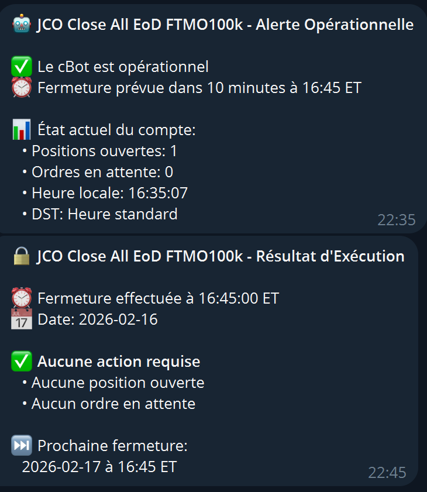

# cTrader Bot - JCO Close All EoD



## 📋 Description

**JCO Close All EoD** est un cBot pour cTrader qui ferme automatiquement toutes les positions et annule tous les ordres en attente à une heure spécifique chaque jour.

## ✨ Fonctionnalités

- ✅ **Fermeture automatique** de toutes les positions à l'heure configurée
- ✅ **Annulation automatique** de tous les ordres en attente
- ✅ **Gestion automatique DST** (changement d'heure été/hiver)
- ✅ **Vérification post-fermeture + retry automatique** : si le broker refuse une fermeture, le bot réessaie automatiquement après 1 minute
- ✅ **Alertes Telegram** :
  - Alerte préventive X minutes avant la fermeture
  - Alerte de résultat après l'exécution (succès complet ou positions restantes)
- ✅ **Nom personnalisable** dans les alertes Telegram
- ✅ **Alerte test au démarrage** pour valider la connexion Telegram
- ✅ **Multi-symboles** : ferme tous les trades du compte, peu importe le symbole
- ✅ **Logs détaillés** avec P&L total

## ⚙️ Paramètres

### General

- **Fuseau Horaire** : Fuseau horaire de référence (par défaut : Eastern Standard Time)
- **Activer messages détaillés** : Active/désactive les logs verbeux

### Closing Time

- **Heure de fermeture - Heure** : Heure de fermeture (par défaut : 16h)
- **Heure de fermeture - Minutes** : Minutes de fermeture (par défaut : 50)

### Telegram Alert

- **Activer Telegram** : Active/désactive les alertes Telegram
- **Bot Token** : Token de votre bot Telegram
- **Chat ID** : Votre ID de chat Telegram
- **Alerte avant fermeture** : Minutes avant fermeture pour l'alerte préventive (par défaut : 10)
- **Nom affiché dans les alertes** : Nom personnalisé dans les messages Telegram (par défaut : JCO Close All EoD)

### Test

- **Envoyer alerte test au démarrage** : Envoie un message Telegram au lancement pour valider la connexion

## 🚀 Installation

1. Copiez le fichier `JCO Close All EoD.cs` dans votre dossier cTrader
2. Compilez le cBot dans cTrader
3. Configurez les paramètres selon vos besoins

## 📱 Configuration Telegram

Pour recevoir les alertes Telegram :

1. Créez un bot Telegram via [@BotFather](https://t.me/botfather)
2. Récupérez le **Bot Token**
3. Obtenez votre **Chat ID** (utilisez [@userinfobot](https://t.me/userinfobot))
4. Renseignez ces informations dans les paramètres du cBot

## 💡 Utilisation

1. **Lancez le cBot sur un timeframe M5 (5 minutes) ou moins** pour une détection précise
2. Le symbole sur lequel vous lancez le cBot n'a pas d'importance
3. Le cBot fermera **tous les trades et ordres** du compte à l'heure configurée

### ⏰ Fenêtre de détection

Le cBot vérifie l'heure à chaque nouvelle bougie et utilise une fenêtre de 2 minutes pour capturer l'événement :

- Si fermeture configurée à **16h50**
- Détection entre **16h50 et 16h52**

### 🔄 Mécanisme de retry

Si le broker refuse une fermeture (ex. marché fermé, requête rejetée) :

1. Le bot détecte les positions encore ouvertes après la 1ère tentative
2. Il attend **1 minute** et relance automatiquement la fermeture
3. Le rapport final indique le résultat des 2 tentatives cumulées

## 📊 Exemples de messages

### Alerte préventive (10 min avant)

```text
🤖 JCO Close All EoD - Alerte Opérationnelle

✅ Le cBot est opérationnel
⏰ Fermeture prévue dans 10 minutes à 16:50 EDT

📊 État actuel du compte:
   • Positions ouvertes: 3
   • Ordres en attente: 2
   • Heure locale: 16:40:00
   • DST: Heure d'été
```

### Alerte de résultat — Succès complet

```text
🔒 JCO Close All EoD - Résultat d'Exécution

⏰ Fermeture effectuée à 16:50:05 EST
📅 Date: 2026-02-18

📊 Actions effectuées:
   💰 3 position(s) fermée(s)
   • P&L Total: +125.50 USD
   🚫 2 ordre(s) annulé(s)

✅ Toutes les positions ont été clôturées

⏭️ Prochaine fermeture:
   2026-02-19 à 16:50 EST
```

### Alerte de résultat — Positions restantes après retry

```text
⚠️ JCO Close All EoD - Résultat d'Exécution

⏰ Fermeture effectuée à 16:50:05 EST
📅 Date: 2026-02-18
🔄 Rapport après 2ème tentative

📊 Actions effectuées:
   💰 2 position(s) fermée(s)
   • P&L Total: +80.00 USD
   🚫 1 ordre(s) annulé(s)

🚨 ATTENTION - Positions non clôturées:
   • Positions encore ouvertes: 1
   • Ordres encore en attente: 0
   ⚠️ Vérifiez votre compte manuellement

⏭️ Prochaine fermeture:
   2026-02-19 à 16:50 EST
```

## ⚠️ Important

- Le cBot doit être lancé sur un **timeframe M5 (5 minutes) ou moins**
- La détection de l'heure dépend de la fréquence des bougies
- Testez d'abord en compte démo !

## 📝 Changelog

### Version 1.4 _(2026-05-01)_

- Affichage du label de fuseau horaire correct dans les alertes Telegram (EST/EDT, CET/CEST, GMT/BST, JST, AEST/AEDT…) au lieu d'un « ET » codé en dur

### Version 1.3 _(2026-03-14)_

- Affichage de l'equity du compte dans l'alerte Telegram de résultat d'exécution

### Version 1.2 _(2026-02-18)_

- Vérification post-fermeture : contrôle que toutes les positions ont bien été clôturées
- Retry automatique après 1 minute en cas de refus du broker
- Rapport final enrichi : succès complet ou positions restantes avec alerte manuelle

### Version 1.1 _(2026-01-18)_

- Nom personnalisable dans les alertes Telegram
- Alerte test au démarrage pour valider la connexion Telegram

### Version 1.0

- Fermeture automatique à heure configurable
- Gestion DST automatique
- Alertes Telegram
- Logs détaillés

## 👤 Auteur

JCO Trading

## 📄 License

Ce code est fourni à des fins éducatives. Utilisez-le à vos propres risques.

---

**⚠️ Disclaimer** : Le trading comporte des risques. Ce bot ne garantit aucun profit particulier. Utilisez-le à vos propres risques.
